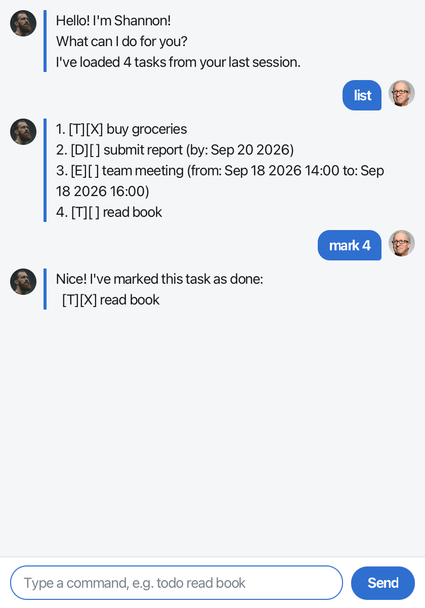

# Shannon User Guide



**Shannon** is a chatbot that keeps your to-do list for you. Tell it about your todos, deadlines
and events in short typed commands, and it keeps track of them, and remembers them the next time
you open it.

- [Quick start](#quick-start)
- [Features](#features)
- [Command summary](#command-summary)

## Quick start

1. Make sure you have **Java 25** installed. You can check by running `java -version` in a
   terminal.
2. Download the latest `shannon.jar` from the [Releases page](https://github.com/ravanc/ip/releases).
3. Put `shannon.jar` in an empty folder of your choice. Shannon saves your tasks in that folder.
4. Open a terminal in that folder and run `java -jar shannon.jar`. The chat window opens.
5. Type a command in the box at the bottom and press Enter (or click **Send**). Try these:
   - `todo read book` adds a task.
   - `list` shows all your tasks.
   - `bye` closes Shannon.

If you make a mistake, Shannon replies in red with what went wrong and an example of the right
command.

## Features

> **About the command format**
>
> - Words in `UPPER_CASE` are for you to fill in. In `todo DESCRIPTION`, `DESCRIPTION` could be
>   `read book`.
> - Items in square brackets are optional, and `...` means the item can be repeated. So
>   `mark TASK_NUMBER [TASK_NUMBER]...` accepts `mark 2` as well as `mark 2 4 5`.
> - A `DATE` is written `yyyy-mm-dd`, e.g. `2026-09-20`. A time is written in 24-hour `HH:mm`
>   form, e.g. `14:00`.
> - A `TASK_NUMBER` is the task's number as shown by `list`.
> - Command words can be in any case: `LIST` works just like `list`.

### Adding a todo: `todo`

Adds a task with nothing but a description.

Format: `todo DESCRIPTION`

Example: `todo read book`

```
Got it. I've added this task:
  [T][ ] read book
Now you have 4 tasks in the list.
```

### Adding a deadline: `deadline`

Adds a task that must be done by a certain date.

Format: `deadline DESCRIPTION /by DATE`

Example: `deadline submit report /by 2026-09-20`

```
Got it. I've added this task:
  [D][ ] submit report (by: Sep 20 2026)
Now you have 2 tasks in the list.
```

### Adding an event: `event`

Adds a task that starts at one time and ends at a later one.

Format: `event DESCRIPTION /from START /to END`

- `START` and `END` are each a date, optionally followed by a time: `2026-09-18` or
  `2026-09-18 14:00`.
- An `END` without a time lasts until the end of that day, so
  `event camp /from 2026-10-03 /to 2026-10-04` covers both days.
- The event must end after it starts.

Example: `event team meeting /from 2026-09-18 14:00 /to 2026-09-18 16:00`

```
Got it. I've added this task:
  [E][ ] team meeting (from: Sep 18 2026 14:00 to: Sep 18 2026 16:00)
Now you have 3 tasks in the list.
```

Shannon won't add a task you already have, with the same description (ignoring capitals) and
the same dates. It tells you the number of the one already in your list instead.

### Listing all tasks: `list`

Shows every task, numbered in the order you added them.

Format: `list`

```
1. [T][X] buy groceries
2. [D][ ] submit report (by: Sep 20 2026)
3. [E][ ] team meeting (from: Sep 18 2026 14:00 to: Sep 18 2026 16:00)
4. [T][ ] read book
```

The first box shows the kind of task: `T` for a todo, `D` for a deadline and `E` for an event.
The second box has an `X` if the task is done.

### Marking tasks as done: `mark`, `unmark`

`mark` ticks off one or more tasks, and `unmark` changes them back to not done.

Format: `mark TASK_NUMBER [TASK_NUMBER]...` or `unmark TASK_NUMBER [TASK_NUMBER]...`

Example: `mark 2 4`

```
Nice! I've marked these tasks as done:
  [D][X] submit report (by: Sep 20 2026)
  [T][X] read book
```

### Deleting tasks: `delete`

Removes one or more tasks from your list for good.

Format: `delete TASK_NUMBER [TASK_NUMBER]...`

Example: `delete 1 3`

```
Noted. I've removed these tasks:
  [T][X] buy groceries
  [E][ ] team meeting (from: Sep 18 2026 14:00 to: Sep 18 2026 16:00)
Now you have 2 tasks in the list.
```

For `mark`, `unmark` and `delete`, all the numbers are checked before anything changes. If
one of them doesn't exist, Shannon says so and leaves every task alone, so a command is never
only half done. A number typed twice counts once, so `delete 2 2` removes only the second task.

### Finding tasks: `find`

Shows every task whose description contains a keyword.

Format: `find KEYWORD`

- The search ignores capitals and matches part of a word, so `find book` also finds
  "Bookshop".
- Only descriptions are searched, not dates.
- Everything after `find` is one keyword, so `find team meeting` looks for that whole phrase.

Example: `find book`

```
Here are the matching tasks in your list:
1. [T][ ] read book
2. [D][ ] return Bookshop loan (by: Sep 01 2026)
```

The numbers here only count the matches. To mark or delete one of them, run `list` first and
use the number shown there.

### Exiting: `bye`

Says goodbye, then closes the window a moment later.

Format: `bye`

### Saving your tasks

There's no need to save by hand: Shannon saves after every change. Your tasks are kept in
`data/shannon.txt`, in the folder you ran Shannon from.

You can edit that file yourself if you're careful. If Shannon can't understand a line in it,
Shannon skips that line when it starts and tells you. It also keeps a copy of the original file at
`data/shannon.txt.bak`, so nothing is lost.

## Command summary

| Action   | Format and example                                                                                      |
|----------|---------------------------------------------------------------------------------------------------------|
| Todo     | `todo DESCRIPTION`<br>e.g. `todo read book`                                                             |
| Deadline | `deadline DESCRIPTION /by DATE`<br>e.g. `deadline submit report /by 2026-09-20`                         |
| Event    | `event DESCRIPTION /from START /to END`<br>e.g. `event team meeting /from 2026-09-18 14:00 /to 2026-09-18 16:00` |
| List     | `list`                                                                                                  |
| Mark     | `mark TASK_NUMBER [TASK_NUMBER]...`<br>e.g. `mark 2 4`                                                  |
| Unmark   | `unmark TASK_NUMBER [TASK_NUMBER]...`<br>e.g. `unmark 2`                                                |
| Delete   | `delete TASK_NUMBER [TASK_NUMBER]...`<br>e.g. `delete 1 3`                                              |
| Find     | `find KEYWORD`<br>e.g. `find book`                                                                      |
| Exit     | `bye`                                                                                                   |
